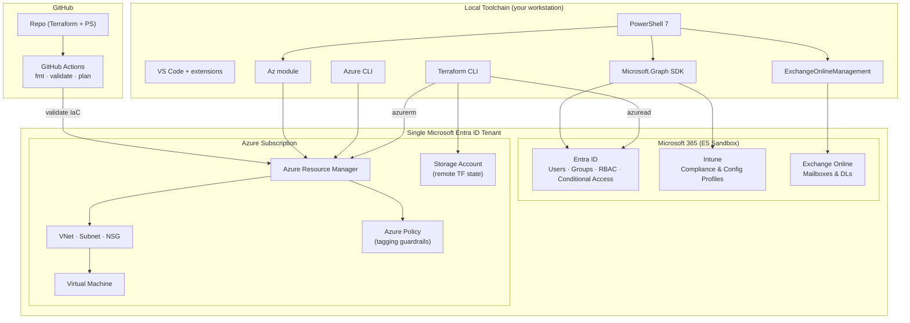
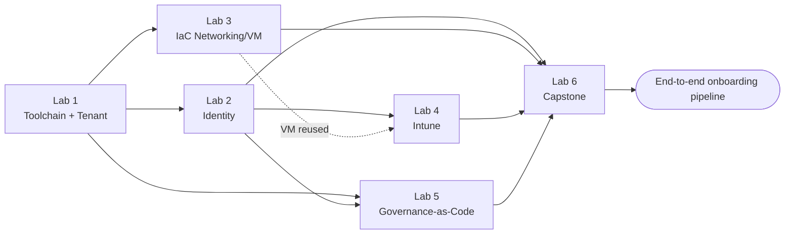

# Hands-On Lab Series — Microsoft 365 • Azure • Terraform • PowerShell


> A self-paced, portfolio-building path from **Entra ID fundamentals** to a **fully automated new-hire onboarding pipeline**. Six labs, beginner → advanced, each independently runnable and destroyable to control Azure cost.

**Built for:** Systems Administrator / Cloud Administrator / Azure Administrator job-search prep
**Platform:** Microsoft 365 Developer Program (free E5 sandbox) + an Azure subscription + a local Terraform / PowerShell toolchain
**Format:** 6 labs, each with prerequisites, numbered steps, a sample Terraform or PowerShell snippet, and a validation checkpoint.

---

## Table of Contents

- [Why This Repo Exists](#why-this-repo-exists)
- [How to Use This Guide](#how-to-use-this-guide)
- [Architecture](#architecture)
- [Lab Overview](#lab-overview)
- [How the Labs Build on Each Other](#how-the-labs-build-on-each-other)
- [The Labs](#the-labs)
  - [Lab 1 — Environment & Toolchain Setup](#lab-1--environment--toolchain-setup)
  - [Lab 2 — Identity Foundations](#lab-2--identity-foundations-users-groups--rbac)
  - [Lab 3 — Infrastructure as Code](#lab-3--infrastructure-as-code-networking--compute)
  - [Lab 4 — Endpoint Management](#lab-4--endpoint-management-intune-enrollment--compliance)
  - [Lab 5 — Governance at Scale](#lab-5--governance-at-scale-policy-as-code)
  - [Lab 6 — Capstone: Onboarding Automation](#lab-6--capstone-new-hire-onboarding-automation)
- [Tools & Technologies](#tools--technologies)
- [Prerequisites](#prerequisites)
- [Repository Structure](#repository-structure)
- [Troubleshooting](#troubleshooting)
- [Lessons Learned](#lessons-learned)
- [Next Steps](#next-steps)
- [Author](#author)
- [License](#license)

---

## Why This Repo Exists

Certifications prove you can pass a test; a repo like this proves you can *do the work*. Each lab produces real Terraform configs and PowerShell scripts you can point an interviewer to. As the guide puts it: **"Built an automated M365/Azure onboarding pipeline with Terraform" is a much stronger interview talking point than a certification alone.**

The series maps closely to the **AZ-104 (Azure Administrator)** domains — identity, networking, compute, governance — and extends beyond them into endpoint management (Intune) and end-to-end automation.

---

## How to Use This Guide

Each lab is **self-contained**: it lists prerequisites, numbered steps, a sample snippet, and a validation checkpoint so you know you actually did the thing before moving on. Labs build on each other loosely (Lab 3's VM is reused in Lab 4), but you can also do them out of order.

- **Cost control:** the Azure resources used here are small and short-lived. Run `terraform destroy` at the end of each lab unless a later lab says to keep the resource. The M365 Developer Program sandbox is free and separate from Azure billing.
- **Portfolio tip:** push your Terraform configs and PowerShell scripts to a public GitHub repo as you go, and let this README summarize what each lab demonstrates.

---

## Architecture

**One identity, both platforms.** You sign up for the M365 Developer sandbox first, then activate an Azure subscription *while signed in as that tenant's Global Administrator* — so the Azure subscription lives inside the same Entra ID tenant. That shared identity is what makes cross-provider Terraform (`azuread` + `azurerm`) and end-to-end onboarding possible.



---

## Lab Overview

| # | Lab | Focus | Est. Time | Difficulty | Cost |
|---|-----|-------|-----------|------------|------|
| 1 | Environment & Toolchain Setup | M365 Dev tenant + Azure + CLI/Terraform install | 1–2 hrs | Beginner | Free |
| 2 | Identity Foundations | Entra ID users/groups, RBAC, Conditional Access, Terraform `azuread` | 2–3 hrs | Beginner → Intermediate | Free |
| 3 | Infrastructure as Code | VNet, NSG, VM via Terraform; remote state | 3–4 hrs | Intermediate | ~cents/hr |
| 4 | Endpoint Management | Intune enrollment, compliance/config profiles, Graph reporting | 2–3 hrs | Intermediate | Free |
| 5 | Governance at Scale | Azure Policy, CA-as-code, CI pipeline, Graph audit script | 3–4 hrs | Advanced | Free |
| 6 | Capstone: Onboarding Automation | End-to-end new-hire pipeline across Entra ID/Intune/Exchange/RBAC | 4–6 hrs | Advanced | Free |

---

## How the Labs Build on Each Other



---

## The Labs

### Lab 1 — Environment & Toolchain Setup

**Objective:** Provision the two platforms every later lab depends on — a Microsoft 365 Developer Program sandbox and an Azure subscription in the *same* Entra ID tenant — and install the CLI/IaC tooling.

**Key steps:** Sign up for the M365 Developer Program ("Instant Sandbox" → a 25-user E5 tenant); activate an Azure Free Account while signed in as the tenant Global Admin so both platforms share one identity; install Azure CLI, PowerShell 7, the `Az` and `Microsoft.Graph` modules, `ExchangeOnlineManagement`, Terraform CLI, and VS Code; authenticate every tool once so credentials cache.

```powershell
# Verify Graph auth
Get-MgUser -Top 5 | Select DisplayName, UserPrincipalName
```
```bash
# Confirm providers can reach your tenant
terraform init
terraform providers
```

**Validation:** `Get-MgUser` returns real sandbox users · `az account show` shows the correct subscription/tenant · `terraform init` completes with no provider errors.

**Skills demonstrated:** Tenant/subscription relationship, CLI and Graph SDK authentication, IaC provider bootstrapping — the connective tissue behind every AZ-104 task.

---

### Lab 2 — Identity Foundations (Users, Groups & RBAC)

**Objective:** Manage identity three ways — portal clicks, PowerShell/Graph scripting, and Terraform — then apply least-privilege RBAC and a Conditional Access policy.

**Key steps:** Manually create 2 users + a security group (`IT-Ops-Test`) in the Entra admin center; bulk-create 5 users from CSV with `New-MgUser` and add them via `New-MgGroupMember`; rewrite the same objects as `azuread_user` / `azuread_group` (use `terraform import` for the manual ones); assign the group a **Reader** role on a resource group with `azurerm_role_assignment` (first cross-provider config); enable an MFA Conditional Access policy; confirm the MFA prompt fires for a test user, then `terraform destroy`.

```hcl
resource "azuread_group" "it_ops_test" {
  display_name     = "IT-Ops-Test"
  security_enabled = true
}

resource "azurerm_role_assignment" "reader" {
  scope                = azurerm_resource_group.lab.id
  role_definition_name = "Reader"
  principal_id         = azuread_group.it_ops_test.object_id
}
```

**Validation:** `Get-MgGroupMember` confirms 5+ members · `terraform plan` shows 0 changes after apply (idempotent) · test sign-in triggers MFA.

**Skills demonstrated:** Entra ID identity lifecycle, Microsoft Graph scripting, RBAC least-privilege, Conditional Access, multi-provider Terraform.

---

### Lab 3 — Infrastructure as Code (Networking & Compute)

**Objective:** Build a resource group, VNet, NSG, and VM entirely as code, store state remotely in Azure Storage, and practice the plan → apply → modify → destroy lifecycle.

**Key steps:** Create a Storage Account + container for remote state; point the `lab3/` backend block at it; define a resource group, VNet + subnet, NSG allowing RDP/SSH **only from your IP**, public IP, NIC, and a small VM; drive values from `variables.tf` + `terraform.tfvars`; review the `plan` diff, `apply`, connect via RDP/SSH, modify a value, re-plan, then `destroy`.

```hcl
terraform {
  backend "azurerm" {
    resource_group_name  = "rg-tfstate"
    storage_account_name = "sttfstatelab3"
    container_name       = "tfstate"
    key                  = "lab3.terraform.tfstate"
  }
}

variable "admin_ip" {
  description = "Your public IP for NSG scoping"
  type        = string
}
```

**Validation:** `terraform state list` shows RG, VNet, NSG, VM · RDP/SSH succeeds from your IP and fails elsewhere · `terraform destroy` leaves 0 resources.

**Skills demonstrated:** Azure networking (VNet/NSG) and compute fundamentals, Terraform remote state, variables, lifecycle management.

---

### Lab 4 — Endpoint Management (Intune Enrollment & Compliance)

**Objective:** Enroll a device into Intune, enforce compliance and configuration policies, and report compliance state with Microsoft Graph.

**Key steps:** Set the MDM authority and enable Windows auto-enrollment; enroll a test device (the Lab 3 VM works) and confirm it under Intune → Devices; create a compliance policy (BitLocker + minimum OS) assigned to `IT-Ops-Test`; create a configuration profile (screen-lock timeout, disable removable storage); force a policy sync; export the device's compliance state to CSV.

```powershell
Get-MgDeviceManagementManagedDevice |
  Select DeviceName, ComplianceState, OperatingSystem, LastSyncDateTime |
  Export-Csv .\intune-compliance-report.csv -NoTypeInformation
```

**Validation:** Device shows "Compliant" after sync · config profile settings visible on the device · CSV matches the portal.

**Skills demonstrated:** Intune MDM enrollment, compliance/configuration policy design, Graph-based reporting.

---

### Lab 5 — Governance at Scale (Policy-as-Code)

**Objective:** Enforce governance guardrails as code — Azure Policy for tagging, Conditional Access for admin MFA — add a CI pipeline that validates Terraform, and script a Graph-based compliance audit.

**Key steps:** Write an `azurerm_policy_definition` + `azurerm_policy_assignment` requiring `environment` and `owner` tags on every resource group; create an untagged RG to confirm the Deny/Audit effect; add a CA policy requiring MFA for Global Admin / Privileged Role Admin; add a GitHub Actions workflow running `fmt -check`, `validate`, and `plan` on every push (Azure creds as repo secrets); deliberately break the config to see CI fail, then fix it; write a Graph script flagging any licensed user without MFA registered.

```yaml
name: terraform-ci
on: [push]
jobs:
  validate:
    runs-on: ubuntu-latest
    steps:
      - uses: actions/checkout@v4
      - uses: hashicorp/setup-terraform@v3
      - run: terraform fmt -check
      - run: terraform init
      - run: terraform validate
      - run: terraform plan
```

**Validation:** untagged RG triggers a policy audit/deny · CI fails on broken syntax and passes after the fix · audit script flags at least one no-MFA user.

**Skills demonstrated:** Azure Policy, governance-as-code, CI/CD fundamentals, Graph-based security auditing.

---

### Lab 6 — Capstone: New-Hire Onboarding Automation

**Objective:** Tie every previous lab into one end-to-end automated workflow that takes new-hire details as input and provisions the Entra ID account, license, group memberships, Intune scope, Azure RBAC, and mailbox configuration — with logging and a rollback path.

**Key steps:** Define the input contract (JSON with name, title, department, manager — a stand-in for a ServiceNow ticket); write a PowerShell script (or per-hire Terraform module) that creates the user, assigns an E5 license, adds department + Intune policy groups, assigns Azure RBAC where warranted, and configures Exchange shared-mailbox/DL membership; add a `-WhatIf` dry-run plus a JSON/transcript log; write a one-page runbook; run it end-to-end for a fictitious hire, then run offboarding/rollback and confirm nothing is orphaned.

```powershell
param(
  [Parameter(Mandatory)] [string]$DisplayName,
  [Parameter(Mandatory)] [string]$Department,
  [switch]$WhatIf
)
if ($WhatIf) {
  Write-Host "[DRY RUN] Would create user: $DisplayName in $Department"
} else {
  New-MgUser -DisplayName $DisplayName -AccountEnabled ...
  Add-Content -Path .\onboarding-log.json -Value (ConvertTo-Json @{
    action = "user_created"; user = $DisplayName; time = (Get-Date)
  })
}
```

**Validation:** new hire appears in Entra ID — licensed, in correct groups, in Intune scope, with correct RBAC · mailbox + DL configured · rollback removes the test hire with no orphans · runbook is clear enough for someone else to run.

**Skills demonstrated:** Full-stack identity/endpoint/governance automation, PowerShell scripting discipline, runbook documentation — the strongest single portfolio piece in the series.

---

## Tools & Technologies

| Category | Tool / Service |
|---|---|
| Cloud platform | Microsoft Azure (Free Account) |
| SaaS / tenant | Microsoft 365 Developer Program (E5 sandbox, 25 users) |
| Identity | Microsoft Entra ID — Users, Groups, RBAC, Conditional Access |
| Endpoint | Microsoft Intune (MDM, compliance & configuration profiles) |
| Messaging | Exchange Online |
| Infrastructure as Code | Terraform (`azurerm` + `azuread` providers), remote state in Azure Storage |
| Governance | Azure Policy (tagging guardrails) |
| Scripting | PowerShell 7 — `Az`, `Microsoft.Graph`, `ExchangeOnlineManagement` |
| CLI | Azure CLI |
| CI/CD | GitHub + GitHub Actions (`fmt` → `validate` → `plan`) |
| Editor | VS Code + Terraform & PowerShell extensions |
| Source control | Git / GitHub |

---

## Prerequisites

- A Microsoft / outlook.com account (personal is fine) to sign up for the M365 Developer Program.
- A device where you can install software (Windows, Mac, or Linux) and basic comfort with a terminal.
- **Terraform CLI**, **Azure CLI**, and **PowerShell 7+** installed and authenticated.
- The PowerShell modules `Az`, `Microsoft.Graph`, and `ExchangeOnlineManagement`.
- A free **GitHub** account (needed from Lab 5 onward for the CI pipeline).
- For Lab 4: a Windows test device or VM you can enroll (the Lab 3 VM works).

```powershell
Install-Module Az -Scope CurrentUser
Install-Module Microsoft.Graph -Scope CurrentUser
Install-Module ExchangeOnlineManagement -Scope CurrentUser
```

---

## Setup (verified toolchain)

This lab series was built and tested on **macOS (Intel)** with the toolchain
below. The exact versions are recorded so the environment is reproducible; any
recent release should work equally well.

| Tool | Version tested | Install (macOS / Homebrew) |
|------|----------------|----------------------------|
| Git | 2.55 | `brew install git` (or Xcode CLT) |
| Azure CLI | 2.87.0 | `brew install azure-cli` |
| Terraform | 1.15.7 | `brew tap hashicorp/tap && brew install hashicorp/tap/terraform` |
| GitHub CLI | 2.96.0 | `brew install gh` |
| Visual Studio Code | 1.128.0 | `brew install --cask visual-studio-code` |
| PowerShell 7 | 7.6.3 | download the `*-osx-x64.pkg` (Intel) from the [PowerShell releases page](https://github.com/PowerShell/PowerShell/releases/latest) |

> **PowerShell on macOS:** Homebrew no longer ships a stable `powershell` cask,
> so install from the official `.pkg`. On Apple Silicon use the `*-osx-arm64.pkg`
> instead of `-osx-x64`.

Then install the PowerShell modules (run inside `pwsh`):

| Module | Version tested |
|--------|----------------|
| Az | 16.1.0 |
| Microsoft.Graph | 2.38.0 |
| ExchangeOnlineManagement | 3.10.0 |

```powershell
Install-Module Az -Scope CurrentUser
Install-Module Microsoft.Graph -Scope CurrentUser
Install-Module ExchangeOnlineManagement -Scope CurrentUser
```

> **Tip:** If a module install prompts about installing from an untrusted
> repository, answer **A** (Yes to All). To skip that prompt entirely, first run
> `Set-PSRepository -Name PSGallery -InstallationPolicy Trusted`.

In VS Code, install the **HashiCorp Terraform** and **PowerShell** extensions
for syntax highlighting, linting, and IntelliSense.

Verify everything with the Lab 1 preflight script:

```powershell
./lab1-setup/Verify-Toolchain.ps1
```

---

## Repository Structure

```text
.
├── lab1-setup/
│   └── Verify-Toolchain.ps1        # Toolchain + connectivity preflight check
├── lab2-identity/
│   ├── providers.tf                # azuread + azurerm + random providers
│   ├── variables.tf
│   ├── main.tf                     # group, user, Reader role assignment
│   ├── New-M365Users.ps1           # bulk user provisioning from CSV
│   └── users.csv
├── lab3-iac/
│   ├── backend.tf                  # remote state (Azure Storage)
│   ├── variables.tf
│   ├── main.tf                     # RG -> VNet -> NSG -> VM
│   ├── outputs.tf
│   └── terraform.tfvars.example    # copy to terraform.tfvars (gitignored)
├── lab4-intune/
│   └── Get-ComplianceReport.ps1    # Graph device compliance export
├── lab5-governance/
│   ├── policy.tf                   # require environment + owner tags
│   ├── Audit-MfaRegistration.ps1   # flag users without MFA registered
│   └── .github/workflows/
│       └── terraform-ci.yml        # fmt -> init -> validate (move to repo root to run)
├── lab6-capstone/
│   ├── newhire.example.json        # onboarding input contract
│   ├── Onboard-NewHire.ps1         # end-to-end provisioning (supports -WhatIf)
│   ├── Offboard-User.ps1           # rollback / offboarding
│   └── RUNBOOK.md                  # one-page operational guide
├── .gitignore
├── LICENSE
└── README.md
```

---

## Troubleshooting

| Issue | Likely cause | Resolution |
|---|---|---|
| `terraform init` fails on the backend | The state Storage Account / container doesn't exist yet | Create it (or bootstrap it) before `init`, per Lab 3 |
| `Error: building AzureRM Client` | Not logged in / wrong subscription | `az login`, then `az account set --subscription <id>` |
| `AuthorizationFailed` on apply | Account lacks the role to create the resource or role assignment | Use an account with Contributor + User Access Administrator, or a scoped service principal |
| Terraform wants to recreate manual objects (Lab 2) | Portal-created users/groups aren't in state | `terraform import` them before `apply` |
| `Insufficient privileges` in Graph | Required scopes not consented | Re-run `Connect-MgGraph -Scopes "..."`; a Global Admin may need to consent |
| MFA prompt doesn't fire (Lab 2) | CA policy not targeting the user, or replication delay | Confirm the user is in `IT-Ops-Test` and the policy is enabled; test in a private window |
| Device won't enroll (Lab 4) | MDM authority / auto-enrollment not set | Set the MDM authority and enable Windows auto-enrollment first |
| Device stuck "Not compliant" | Policy hasn't synced | Force a sync (Access work or school → Info → Sync) and re-check |
| GitHub Actions can't auth to Azure (Lab 5) | Credentials not stored / wrong secret names | Store Azure creds as **repo secrets**, never in code |
| Terraform state lock error | A prior run didn't release the lock | Confirm no run is active, then `terraform force-unlock <LOCK_ID>` (carefully) |
| Unexpected Azure charges | A VM/resource left running | Run `terraform destroy` at the end of each lab unless told to keep it |

---

## Lessons Learned

- **One identity, two platforms.** Activating Azure while signed in as the sandbox's Global Admin is what makes cross-provider Terraform and end-to-end onboarding possible — get this right in Lab 1 and everything downstream is simpler.
- **Import before you apply.** Portal-created objects will be "recreated" by Terraform unless you `terraform import` them first — a classic drift trap.
- **Remote state early.** Storing state in Azure Storage with locking prevents the conflicts and lost-state pain of local-only files.
- **Secrets stay out of code.** `terraform.tfvars` is gitignored and CI credentials live in repo secrets — never in the repo history.
- **Plan, read, then apply.** Reviewing the `plan` diff catches destructive changes before they happen.
- **Tag everything.** Azure Policy for `environment`/`owner` tags turns cost and ownership reporting into a solved problem.
- **`-WhatIf` is change-management discipline.** A dry-run mode plus a JSON action log turns "a script that runs" into "a process someone can trust."
- **Destroy to control cost.** The habit of tearing down after each lab keeps an Azure Free Account genuinely free.

---

## Next Steps

Once all six labs are complete, package the Terraform configs and PowerShell scripts into a public GitHub repo with this README summarizing each lab and what it demonstrates, then link it from your resume and LinkedIn. To go further, extend the capstone with a **Jamf Pro** trial (macOS endpoint parity with Intune) or a **ServiceNow** developer instance so the onboarding pipeline is triggered by an actual ticket rather than a manual run.

---

## Author

**Glen Page** — Cloud Engineer (Microsoft Azure) · CompTIA Security+
Hands-on Microsoft Azure experience since January 2024, focused on Terraform/IaC, Microsoft Entra ID and RBAC, endpoint management, governance, and PowerShell automation.

- Location: Monroe, NY
- Email: 251841062+glenpagesr-dev@users.noreply.github.com
- LinkedIn: https://www.linkedin.com/in/glen-page-862730246
- GitHub: https://github.com/glenpagesr-dev

---

## License

Released under the **MIT License**. See [`LICENSE`](LICENSE) for details.
